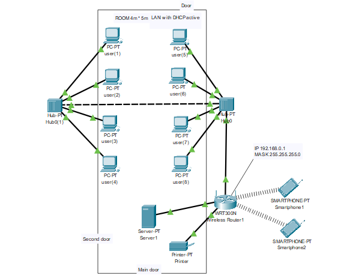

# Network School Project



## About
Welcome to the Network School project! This endeavor is designed for a small network, connecting eight computers, one server (main computer), and a printer. The network is configured to provide wireless connectivity (inhalambric) and can easily accommodate additional devices as needed.

While this project primarily serves as a simulation, it can be translated into real-life implementation by swapping out components and identifying the necessary tools for your specific environment.

## System Requirements
- Cisco Packet Tracer v.8: Please note that this project is specifically designed for Cisco Packet Tracer version 8. It may not be compatible with later versions of the program.

## Getting Started

#### Clone this Repository
To clone this repository to your local machine, use the following command:
```bash
git clone https://github.com/tu-usuario/tu-repositorio.git
```
1. **Installation:**
   - Ensure you have Cisco Packet Tracer v.8 installed on your machine.
   - Download the project files and open the main file with Cisco Packet Tracer.

2. **Configuration:**
   - Familiarize yourself with the network components and their connections.
   - Explore the wireless capabilities and the potential for adding more devices.

3. **Simulation:**
   - Use Cisco Packet Tracer's simulation features to observe the network in action.
   - Troubleshoot and make adjustments as needed.

## Real-Life Implementation
If you're inspired to implement this network in a physical environment, follow these steps:

1. **Hardware Procurement:**
   - Identify and acquire the necessary networking hardware, including routers, switches, computers, a server, and a printer.

2. **Software Setup:**
   - Install the required networking software on the server and computers.
   - Configure the devices with appropriate IP addresses and network settings.

3. **Wireless Integration:**
   - If wireless connectivity is desired, ensure that the necessary wireless access points or routers are procured and configured.

4. **Expandability:**
   - Plan for future expansion by selecting components that can easily accommodate additional devices.

> [!NOTE]
Using Cisco Packet Tracer v.8. Compatibility with later versions of the program is not guaranteed.
